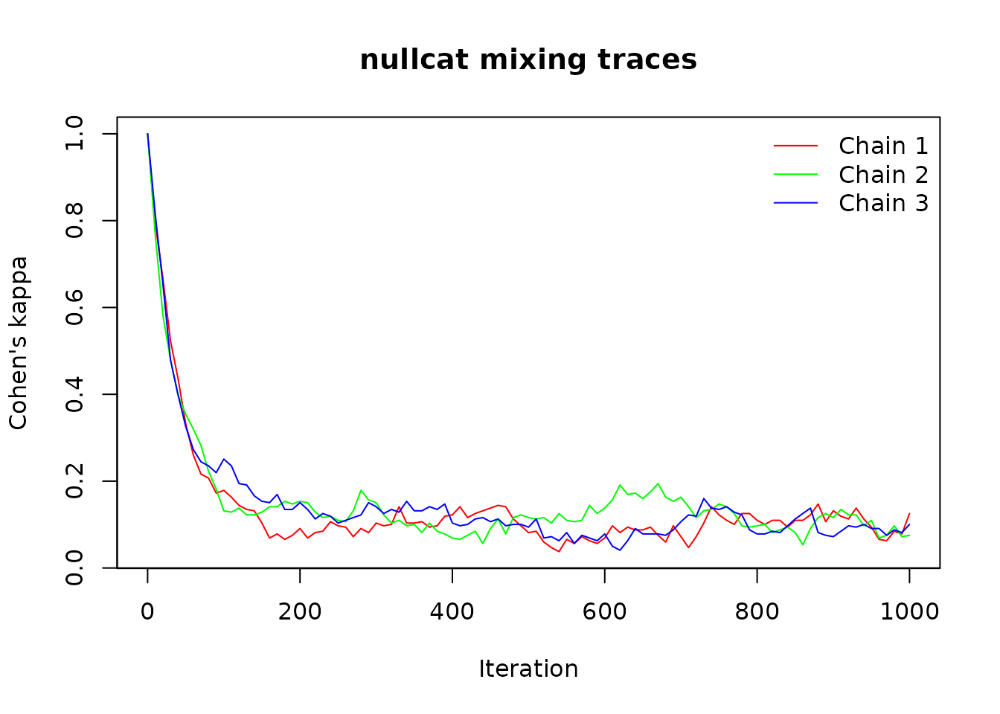

# Introduction to nullcat

``` r
library(nullcat)
```

## Introduction

`nullcat` provides null model algorithms for categorical and
quantitative community ecology data. It extends classic binary null
models (e.g., curveball, swap) to work with categorical data, and
introduces a stratified randomization framework for continuous data.

Categorical null models generalize binary null models to matrices where
cells contain integers representing discrete categories. Whereas binary
models preserve totals (e.g. row or column sums), categorical models
preserve **multisets** (e.g. category frequencies in each row or
column). For example, if a row contains \[1, 1, 2, 3, 3, 3\], a
row-preserving categorical algorithm would preserve this exact
multiset—two 1s, one 2, and three 3s—while randomizing where these
categories appear within the row.

Traditional binary models are simply the specific two-category cases of
their corresponding general categorical models (e.g. `curveball` is
equivalent to `curvecat` with only two categories).

### Use cases

Categorical null models are designed for **cell-level categorical
data**—characteristics of a species at a site—rather than site-level or
species-level attributes. They can be useful for categorical and ordinal
ecological data. Examples include:

- Ordinal states: phenological stages, health status, life stages
- Multi-state interactions: interaction type, infection status,
  mutualism outcomes
- Population genetic states: genotypes or allelic frequencies at the
  population level
- Binned quantitative measures: abundance classes, cover scales, or
  occurrence probability bins (the
  [`quantize()`](https://matthewkling.github.io/nullcat/reference/quantize.md)
  function covered below automates binning and randomization)
- Binary data: species presence-absence data or similar

## Categorical null models

### Available algorithms

The package provides five categorical null model algorithms:

- **[`curvecat()`](https://matthewkling.github.io/nullcat/reference/curvecat.md)**:
  Categorical curveball (most efficient)
- **[`swapcat()`](https://matthewkling.github.io/nullcat/reference/swapcat.md)**:
  Categorical 2×2 swap
- **[`tswapcat()`](https://matthewkling.github.io/nullcat/reference/tswapcat.md)**:
  Categorical trial-swap
- **[`r0cat()`](https://matthewkling.github.io/nullcat/reference/r0cat.md)**:
  Row-constrained randomization
- **[`c0cat()`](https://matthewkling.github.io/nullcat/reference/c0cat.md)**:
  Column-constrained randomization

### Example: Basic categorical randomization

``` r
# Create a categorical matrix
set.seed(123)
x <- matrix(sample(1:4, 100, replace = TRUE), nrow = 10)

# Randomize using curvecat (preserves row & column category multisets)
x_rand <- curvecat(x, n_iter = 1000)

# Verify margins are preserved
all.equal(sort(x[1, ]), sort(x_rand[1, ]))  # Row preserved
#> [1] TRUE
all.equal(sort(x[, 1]), sort(x_rand[, 1]))  # Column preserved
#> [1] TRUE
```

### Understanding fixed margins

Different algorithms preserve different margins:

``` r
set.seed(456)
x <- matrix(sample(1:3, 60, replace = TRUE), nrow = 10)

# Fixed-fixed: both row and column margins preserved
x_fixed <- curvecat(x, n_iter = 1000)

# Row-constrained: only row margins preserved
x_row <- r0cat(x)

# Column-constrained: only column margins preserved
x_col <- c0cat(x)

# Check row sums by category
table(x[1, ])           # Original row 1
#> 
#> 1 2 3 
#> 2 2 2
table(x_fixed[1, ])     # Preserved in curvecat
#> 
#> 1 2 3 
#> 2 2 2
table(x_row[1, ])       # Preserved in r0cat
#> 
#> 1 2 3 
#> 2 2 2
table(x_col[1, ])       # Not preserved in c0cat
#> 
#> 1 2 3 
#> 1 3 2
```

## Quantitative null models

The
[`quantize()`](https://matthewkling.github.io/nullcat/reference/quantize.md)
function provides stratified randomization for continuous community data
(abundance, biomass, cover, occurrence probability). It works by
applying the following steps:

1.  **Stratify**: use a flexible binning scheme to convert continuous
    values into discrete strata
2.  **Randomize**: apply one of the categorical null models described
    above to the stratified matrix
3.  **Reassign**: map randomized strata back to original values, subject
    to a chosen constraint

**Why use quantize?** Existing quantitative null models lack flexibility
in what margins they preserve. While binary curveball elegantly
preserves row and column totals, and vegan’s quasiswap models do this
for count data, there’s no framework for preserving row and/or column
**value distributions** for continuous data (abundance, biomass, cover).
The stratification approach fills this gap: when using `fixed = "row"`
or `fixed = "col"`, one dimension’s value multisets are preserved
exactly while the other is preserved at the resolution of strata. This
is the closest available approximation to a quantitative fixed-fixed
null model. Additionally, stratification provides explicit control over
the preservation-randomization tradeoff through the number of strata
used.

### Example: Basic quantitative randomization

``` r
# Create a quantitative community matrix
set.seed(789)
comm <- matrix(runif(200), nrow = 20)

# Default: curvecat-backed stratified randomization with 5 strata
rand1 <- quantize(comm, n_strata = 5, n_iter = 2000, fixed = "row")

# Values are similar but rearranged
cor(as.vector(comm), as.vector(rand1))
#> [1] 0.1757922
plot(rowSums(comm), rowSums(rand1))
```


``` r
plot(colSums(comm), colSums(rand1))
```


### Stratification options

When you call
[`quantize()`](https://matthewkling.github.io/nullcat/reference/quantize.md),
it uses the helper function
[`stratify()`](https://matthewkling.github.io/nullcat/reference/stratify.md)
to convert your continuous data to discrete bins. The stratification
scheme can strongly influence your randomization results, because it is
frequencies of these categories that are constrained during matrix
permutation. By default, data are split into a handful of equal-width
bins, but this can be controlled with parameters including `n_strata`,
`transform`, `zero_stratum`, `breaks`, and `offset`. Let’s call
[`stratify()`](https://matthewkling.github.io/nullcat/reference/stratify.md)
directly here, to understand its behavior—a good idea for a real
analysis, not just a tutorial.

``` r
set.seed(200)
x <- rexp(100, .1)

# More strata = less mixing, higher fidelity to original distribution
s3 <- stratify(x, n_strata = 3)
s10 <- stratify(x, n_strata = 10)

table(s3)   # Coarser bins
#> s3
#>  1  2  3 
#> 89  9  2
table(s10)  # Finer bins
#> s10
#>  1  2  3  4  5  6 10 
#> 49 22 17  4  4  2  2

# Transform before stratifying (e.g., log-transform for skewed data)
s_log <- stratify(x, n_strata = 5, transform = log1p)
table(s_log)
#> s_log
#>  1  2  3  4  5 
#> 14 26 27 27  6

# Rank transform creates equal-occupancy strata
s_rank <- stratify(x, n_strata = 5, transform = rank)
table(s_rank)  # Nearly equal counts per stratum
#> s_rank
#>  1  2  3  4  5 
#> 20 20 20 20 20

# Separate zeros into their own stratum
x_with_zeros <- c(0, 0, 0, x)
s_zero <- stratify(x_with_zeros, n_strata = 4, zero_stratum = TRUE)
table(s_zero)
#> s_zero
#>  1  2  3  4 
#>  3 89  9  2
```

### Controlling what’s preserved

While the mechanics of the chosen randomization algorithm determine
which margins of the randomized *categories* are preserved, the `fixed`
parameter controls how the original *continuous* values are mapped back
onto the randomized categories, determining which margins preserve their
original value distributions. There are four options for the `fixed`
parameter: row, col, cell, and stratum, though only a subset of these
are relevant for some algorithms. For a method like the default
`curvecat` algorithm that preserves both row and column categorical
multisets, all four are available:

``` r
set.seed(100)
comm <- matrix(rexp(100), nrow = 10)

# Preserve row value multisets (quantitative row sums maintained)
rand_row <- quantize(comm, n_strata = 5, fixed = "row", n_iter = 2000)
all.equal(rowSums(comm), rowSums(rand_row))
#> [1] TRUE

# Preserve column value multisets (quantitative column sums maintained)
rand_col <- quantize(comm, n_strata = 5, fixed = "col", n_iter = 2000)
all.equal(colSums(comm), colSums(rand_col))
#> [1] TRUE

# Cell-level preservation: each value moves with its original cell location
# The categorical randomization determines WHERE cells go, but each cell
# carries its original value with it
rand_cell <- quantize(comm, n_strata = 5, fixed = "cell", n_iter = 2000)

# Values shuffled globally within strata, holding none of the above fixed
rand <- quantize(comm, n_strata = 5, fixed = "stratum", n_iter = 2000)

# For non-fixed-fixed methods like r0cat or c0cat, only some fixed options make sense:
# r0cat with fixed="col" or c0cat with fixed="row" would be incompatible
```

## Efficient repeated randomization

The quantize routine includes some setup, including stratification, that
doesn’t need to be repeatedly recomputed when generating multiple
randomized versions of the same matrix. For generating null
distributions, you can pre-compute overhead once using
[`quantize_prep()`](https://matthewkling.github.io/nullcat/reference/quantize_prep.md),
or you can use `*_batch()` functions to efficiently generate multiple
replicates (optionally using parallel processing).

``` r
set.seed(400)
comm <- matrix(rexp(200), nrow = 20)

# Prepare once
prep <- quantize_prep(comm, n_strata = 5, fixed = "row", n_iter = 2000)

# Generate many randomizations efficiently
rand1 <- quantize(prep = prep)
rand2 <- quantize(prep = prep)
rand3 <- quantize(prep = prep)

# Or use batch functions
nulls <- quantize_batch(comm, n_reps = 99, n_strata = 5, 
                       fixed = "row", n_iter = 2000)
dim(nulls)  # 20 rows × 10 cols × 99 replicates
#> [1] 20 10 99
```

## Convergence diagnostics

Sequential algorithms (curvecat, swapcat, tswapcat) require sufficient
iterations to reach stationarity. You can use the
[`trace_cat()`](https://matthewkling.github.io/nullcat/reference/trace_cat.md)
function with either `nullcat` or `quantize` to assess how many
iterations are needed for your particular dataset and algorithm. The
trace shows how similarity to the original matrix changes over
iterations; when the trace stabilizes around zero, the algorithm has
reached stationarity. You can also use
[`suggest_n_iter()`](https://matthewkling.github.io/nullcat/reference/suggest_n_iter.md)
to get an automated suggestion for a reasonable number of burn-in
iterations to reach stationarity.

``` r
set.seed(300)
x <- matrix(sample(1:5, 400, replace = TRUE), nrow = 20)

# Generate trace showing mixing over iterations
trace <- trace_cat(x, fun = "nullcat", method = "curvecat",
                   n_iter = 1000, n_chains = 3, thin = 10)

# Visual inspection
plot(trace)
```



``` r

# Automatic burn-in suggestion
suggested <- suggest_n_iter(trace, tail_frac = 0.3)
print(suggested)
#> suggested_n_iter object
#> -----------------------
#> Converged: TRUE 
#> Suggested n iterations: 290
```

## Integration with `vegan`

`nullcat` includes several functions to integrate with the `vegan`
package’s null model framework. For both
[`nullcat()`](https://matthewkling.github.io/nullcat/reference/nullcat.md)
and
[`quantize()`](https://matthewkling.github.io/nullcat/reference/quantize.md),
there are sequential and non-sequential variants of these functions that
create
[`vegan::commsim()`](https://vegandevs.github.io/vegan/reference/commsim.html)
objects suitable for use with
[`vegan::nullmodel()`](https://vegandevs.github.io/vegan/reference/nullmodel.html)
and
[`vegan::oecosimu()`](https://vegandevs.github.io/vegan/reference/oecosimu.html).
Examples include:

``` r
library(vegan)

# Categorical data
x_cat <- matrix(sample(1:4, 100, replace = TRUE), nrow = 10)
cs <- nullcat_commsim_seq(method = "curvecat")
nm <- nullmodel(x_cat, cs)
sims <- simulate(nm, nsim = 99, burnin = 1000, thin = 100)

# Quantitative data
x_quant <- matrix(rexp(100), nrow = 10)
cs_quant <- quantize_commsim(n_strata = 5, method = "curvecat", n_iter = 2000)
nm_quant <- nullmodel(x_quant, cs_quant)
sims_quant <- simulate(nm_quant, nsim = 99)
```

## References

- Strona et al. (2014). A fast and unbiased procedure to randomize
  ecological binary matrices. *Nature Communications*, 5, 4114.
- Gotelli (2000). Null model analysis of species co-occurrence patterns.
  *Ecology*, 81(9), 2606-2621.

## Further reading

- Package website: <https://matthewkling.github.io/nullcat/>
- Report issues: <https://github.com/matthewkling/nullcat/issues>
